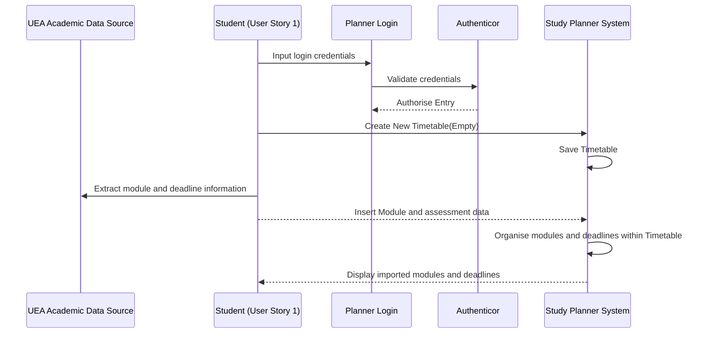
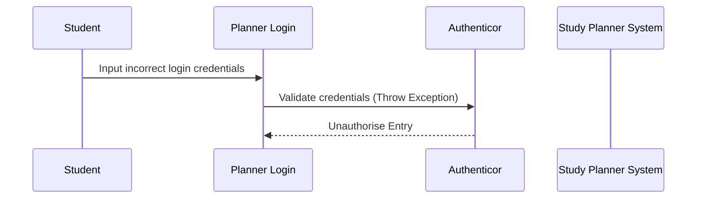
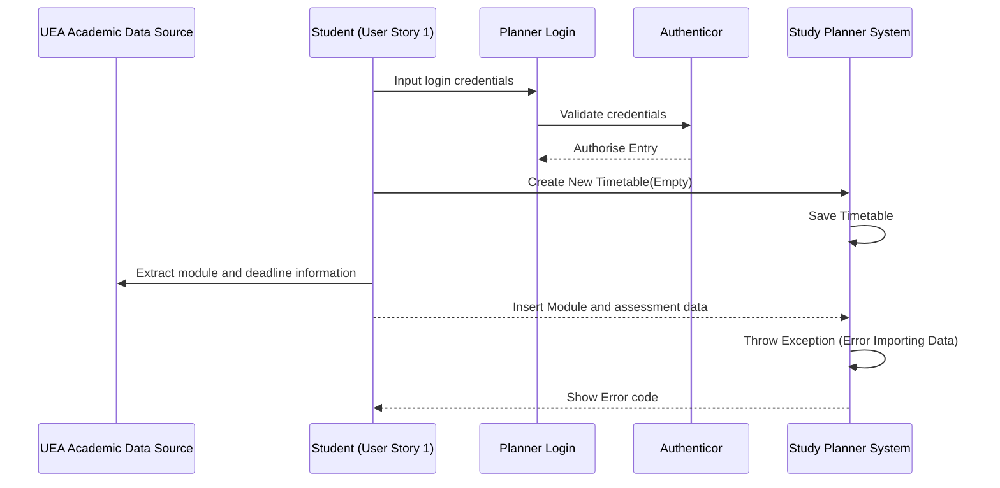
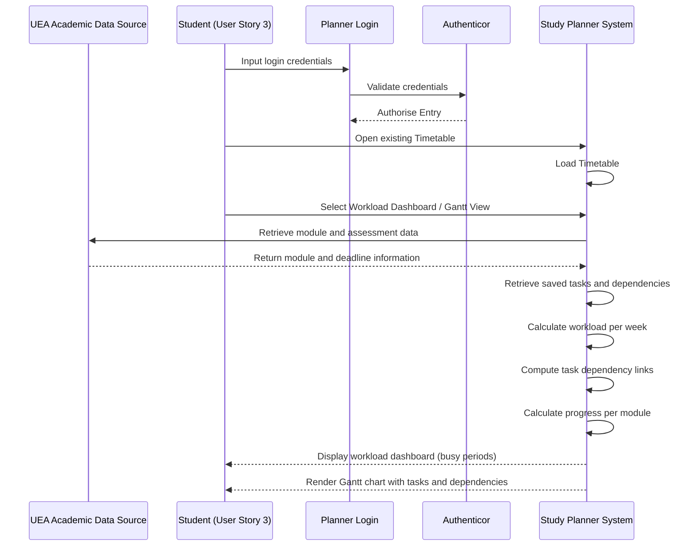
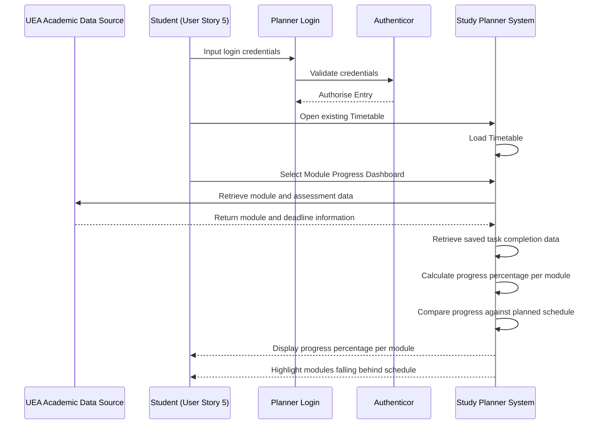

# Sequence Diagrams

## User Story 01 (Happy Path)

## User Story 01 (Unhappy Path 1, Login Error)

## User Story 01 (Unhappy Path 2, Import Error)

## User Story (03) (Happy Path)

## User Story (05) (Happy Path)

