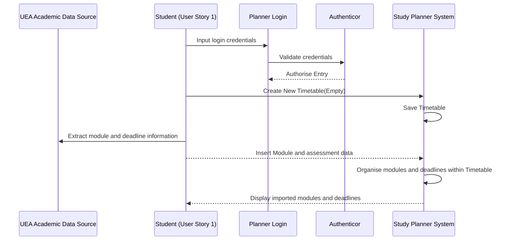
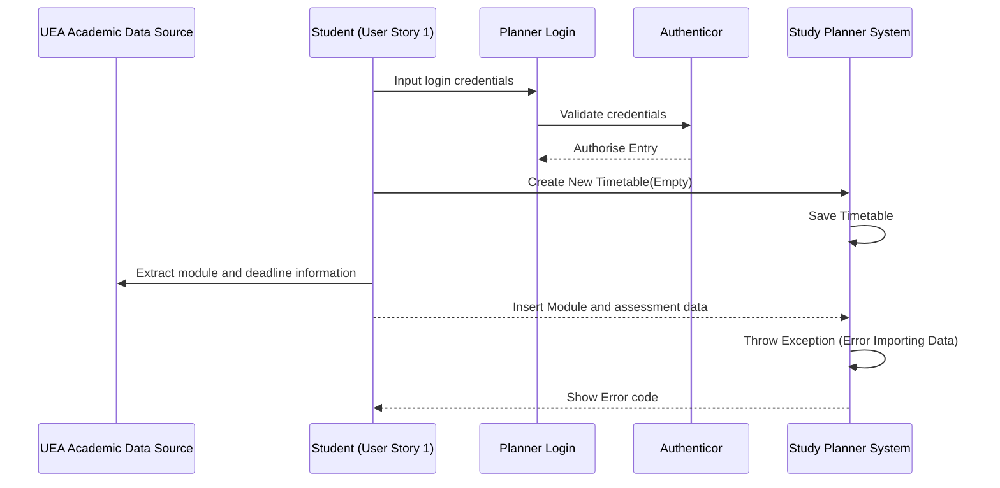

# Sequence Diagrams

## User Story 01 (Happy Path)



## Userpant User as Student (User Story 1)
    participant Login as Planner Login
    participant Auth as Authenticor 
    participant Planner as Study Planner System

    User->>Login: Input incorrect login credentials
    Login->>Auth: Validate credentials (Throw Exception)
    Auth-->>Login: Unauthorise Entry
    %%User->>Planner: Create New Timetable(Empty)
    %%Planner->>Planner: Save Timetable
    %%User->>UEA: Extract module and deadline information
    %%User-->>Planner: Insert Module and assessment data
    %%Planner->>Planner: Organise modules and deadlines within Timetable
    %%Planner-->>User: Display imported modules and deadlines
```

## User Story 01 (Unhappy Path 2, Import Error)



## User Story 02 (Happy Path) Story 01 (Unhappy Path 1, Incorrect Login Details)

```mermaid
sequenceDiagram %% User Story 1 (Unhappy Path 1)
    participant UEA as UEA Academic Data Source
    partici
