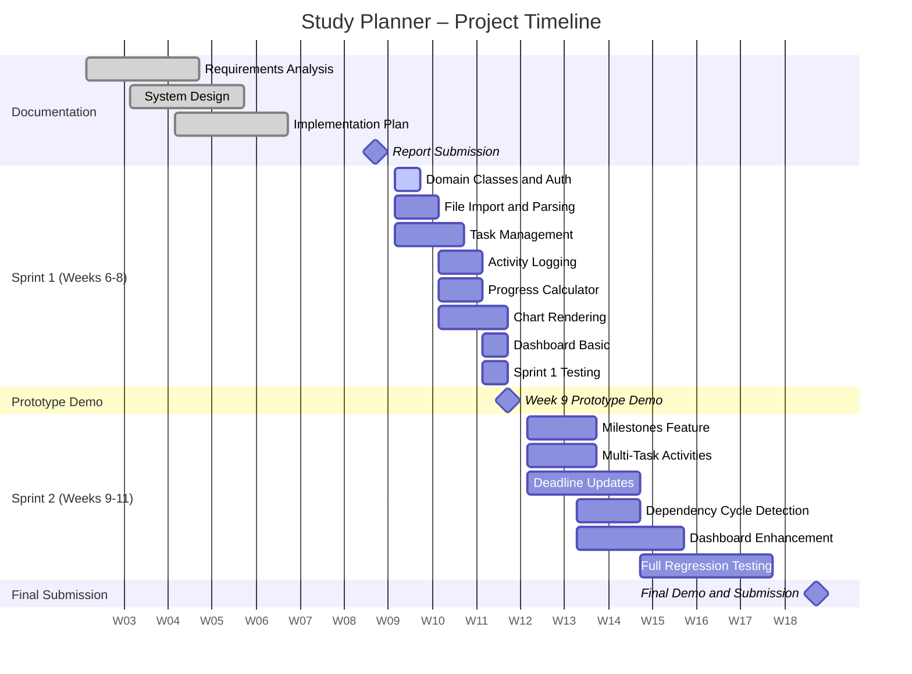

# Planning – Project Roadmap

## Timeline Overview

The project is structured across two sprints within the CMP-5012B module schedule. The table below maps major milestones and deliverables across all 12 weeks.

| Milestone / Task | W1 | W2 | W3 | W4 | W5 | W6 | W7 | W8 | W9 | W10 | W11 | W12 |
|---|---|---|---|---|---|---|---|---|---|---|---|---|
| Requirements Analysis | ● | ● | ● | | | | | | | | | |
| System Design | | ● | ● | ● | | | | | | | | |
| Implementation Plan | | | ● | ● | | | | | | | | |
| **Report Submission** | | | | | ● | | | | | | | |
| Sprint 1 – Core Features | | | | | | ● | ● | ● | | | | |
| **Prototype Demo (W9)** | | | | | | | | | ● | | | |
| Sprint 2 – Extended Features | | | | | | | | | ● | ● | ● | |
| **Final Demo and Submission** | | | | | | | | | | | | ● |

---

## Key Milestones

| Milestone | Week | Date | Description |
|---|---|---|---|
| Requirements and Design Report | Week 6 | 6 March 2026 | Team submission — this document |
| Prototype Demo | Week 9 | approx. 27 March 2026 | Formative feedback session on Sprint 1 features |
| Final Demo and Submission | Week 12 | 15 May 2026 | Full system demonstration and source code submission |

---

## Sprint 1 Goals (Weeks 6–8)

By the end of Sprint 1, the system must demonstrate the following working features:

- [ ] User authentication (login)
- [ ] Module data file import and validation
- [ ] Module and assessment display from imported data
- [ ] Task creation with dependency support
- [ ] Study activity logging (single task)
- [ ] Progress calculation and display
- [ ] Basic timeline chart rendering
- [ ] Basic dashboard showing upcoming deadlines

---

## Sprint 2 Goals (Weeks 9–11)

By the end of Sprint 2, the system must additionally demonstrate:

- [ ] Milestone creation and chart rendering
- [ ] Activity linked to multiple tasks
- [ ] Deadline update feature
- [ ] Circular dependency detection and rejection
- [ ] Full dashboard with completed, upcoming, and missed deadline classification
- [ ] Full regression test suite passing
- [ ] Polished UI and consistent error handling throughout

---

## Project Timeline

---

## Notes

- Sprint dates are approximate and subject to adjustment based on formative feedback received at the Week 9 prototype demo
- All sprint tasks and owners are detailed in [`sprint-plan.md`](sprint-plan.md)
- The full prioritised task list is in [`backlog.md`](backlog.md)
